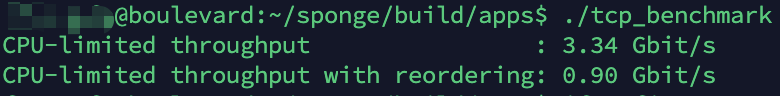

# Stanford-CS144-FALL 2020
https://cs144.github.io/

## Status
- [x] Lab 0: networking warmup
- [x] Lab 1: stitching substrings into a byte stream
- [x] Lab 2: the TCP receiver
- [x] Lab 3: the TCP sender
- [x] Lab 4: the TCP connection
- [x] Lab 5: the network interface
- [x] Lab 6: the IP router

## benchmark

## lab README.md
[README.md](docs/README.md)